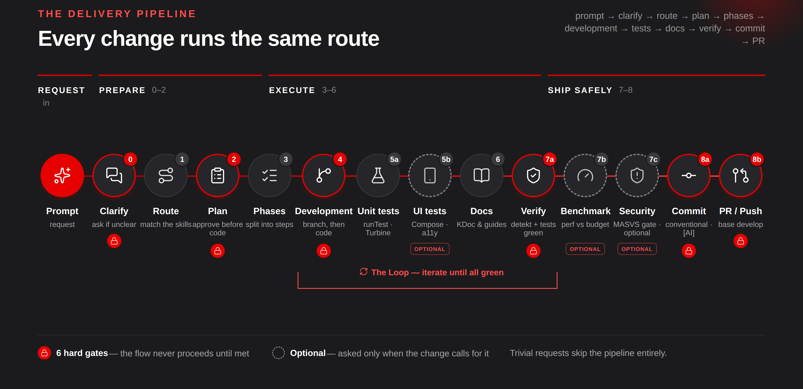

# Skills Architecture

A production-grade **Claude Skills** collection for Android, Kotlin Multiplatform,
and iOS development. Each skill packages the architectural decisions, code
templates, and quality checklists for one domain — Claude loads the right one
on demand and builds to that standard, instead of relying on one giant
"you're an Android expert" prompt.

## Why skills instead of one big prompt?

- **No wasted context.** Only the relevant skill loads for a given request.
- **Decisions live in one place.** You don't re-explain your architecture in
  every conversation — it's already written down and versioned.
- **Team standards version like code.** Update a skill, everyone gets the new
  standard on their next request.
- **Process is encoded too.** [`delivery-pipeline`](skills/delivery-pipeline)
  defines *how* work ships (plan → code → test → document → review → PR), not
  just how to write it.

## What's inside

31 skills across 6 groups. Full routing map and boundary rules:
**[docs/ARCHITECTURE.md](docs/ARCHITECTURE.md)** · in-tree index:
**[skills/README.md](skills/README.md)**.

### Orchestration
| Skill | Scope |
|---|---|
| [`delivery-pipeline`](skills/delivery-pipeline) | **Default entry point.** clarify → route → plan → phase → code → test → document → self-review → commit → push/PR |



### Core — produces code
| Skill | Scope |
|---|---|
| [`android-architect`](skills/android-architect) | Clean Architecture, MVVM/MVI, Hilt, multi-module, layer boundaries |
| [`feature-scaffold`](skills/feature-scaffold) | New feature skeleton spanning domain + data + UI, naming, DI, navigation |
| [`android-data-layer`](skills/android-data-layer) | Offline-first/SSOT, Room, Retrofit/Ktor, Paging 3, WorkManager, DataStore |
| [`android-compose-ui`](skills/android-compose-ui) | Design system, Material 3, theming, animation, accessibility, adaptive UI |
| [`android-navigation`](skills/android-navigation) | Type-safe routes, nav graph, deep links/App Links, back stack, adaptive navigation |
| [`android-auth-credentials`](skills/android-auth-credentials) | Credential Manager, passkeys, federated sign-in, biometric lock, session lifecycle |
| [`android-notifications`](skills/android-notifications) | FCM, notification permission, channel design, deep-link opens, delivery issues |
| [`android-media-camera`](skills/android-media-camera) | CameraX, Media3/ExoPlayer, Photo Picker, Coil, ML Kit image analysis |
| [`mobile-analytics`](skills/mobile-analytics) | Event taxonomy, tracking from the ViewModel, provider abstraction, PII safety |
| [`on-device-ai`](skills/on-device-ai) | ML Kit, Gemini Nano, LiteRT/MediaPipe, on-device/cloud hybrid decision, ADK for Kotlin agents |
| [`feature-flags`](skills/feature-flags) | Flag types, kill switches, A/B tests, staged rollout, flag-debt cleanup |

### Quality — verifies what's produced
| Skill | Scope |
|---|---|
| [`android-testing`](skills/android-testing) | Unit/integration/UI testing, Turbine, MockK, fake vs. mock, flaky-test diagnosis |
| [`android-performance`](skills/android-performance) | Startup, jank, memory, APK size, baseline profiles, ANRs, Macrobenchmark |
| [`android-security`](skills/android-security) | Keystore, cert pinning, token handling, biometrics, Play Integrity, privacy compliance |
| [`mobile-observability`](skills/mobile-observability) | Crash/non-fatal reporting, tracing, release health, alert thresholds, incident response |
| [`mobile-code-review`](skills/mobile-code-review) | PR review, layer-violation, anti-pattern, and security scanning |

### Platform
| Skill | Scope |
|---|---|
| [`android-native-ndk`](skills/android-native-ndk) | JNI, CMake, C++ integration, native crash analysis, ABI, 16 KB page size |
| [`kmp-shared`](skills/kmp-shared) | Kotlin Multiplatform, expect/actual, Ktor/SQLDelight, SKIE, incremental adoption |
| [`ios-swift-architect`](skills/ios-swift-architect) | SwiftUI + Observation, Swift Concurrency, SPM modularity, Swift Testing |
| [`android-adaptive-formfactors`](skills/android-adaptive-formfactors) | Tablet/foldable layouts, window size classes, Glance widgets, Wear/TV decisions |
| [`android-platform-upgrade`](skills/android-platform-upgrade) | targetSdk upgrades, edge-to-edge, predictive back, foreground service types, 16 KB page size |
| [`xml-compose-migration`](skills/xml-compose-migration) | Incremental XML/Fragment → Compose migration, interop, behavioral parity |

### Process
| Skill | Scope |
|---|---|
| [`android-gradle-build`](skills/android-gradle-build) | Version catalog, convention plugins, build-logic, variants, build speed |
| [`git-workflow`](skills/git-workflow) | Branching strategy, atomic commits, rebase/merge, PRs, conflict resolution |
| [`mobile-ci-release`](skills/mobile-ci-release) | GitHub Actions **and Jenkins**, detekt/Sonar gates, signing, staged rollout |

### Documentation
| Skill | Scope |
|---|---|
| [`docs-guide`](skills/docs-guide) | Where information belongs: a skill, `docs/`, or a comment; multi-consumer standards |
| [`adr`](skills/adr) | Architecture Decision Records: context, alternatives, decision, accepted cost |
| [`design-doc`](skills/design-doc) | Pre-implementation technical design, phased delivery plans |
| [`change-docs`](skills/change-docs) | Feature docs / root-cause fix docs / refactor docs / release notes |
| [`kdoc-standards`](skills/kdoc-standards) | KDoc, "why" comments, TODO discipline, Dokka, DocC |

Every skill pairs a decision guide with runnable code and a checklist, and
carries bilingual (Turkish/English) trigger phrases in its description so it
loads correctly regardless of which language you write your request in.

## Requirements

- **[Claude Code](https://claude.com/claude-code)** — this collection uses Claude
  Code's Skill format (`SKILL.md` + YAML frontmatter, loaded from
  `~/.claude/skills/` or `<project>/.claude/skills/`). It does not work in the
  claude.ai web chat.
- **Git** and **Bash** — for `install.sh`, `validate.sh`, and `check-links.sh`.
- No language- or platform-specific tooling is required just to *install* the
  skills; each skill's own prerequisites (Android Studio, Xcode, a Kotlin
  Multiplatform setup, etc.) only matter once you actually use that skill.

## Install

### Personal use (active across all your projects)

```bash
git clone https://github.com/ahmetoguzer/claude-code-mobile-skills.git
cd claude-code-mobile-skills
./scripts/install.sh            # symlinks into ~/.claude/skills/
```

### Single project

```bash
git clone https://github.com/ahmetoguzer/claude-code-mobile-skills.git
./scripts/install.sh --project /path/to/your/project    # <project>/.claude/skills/
```

Or as a submodule:

```bash
git submodule add https://github.com/ahmetoguzer/claude-code-mobile-skills.git .claude/skills-architecture
ln -s ../skills-architecture/skills/android-architect .claude/skills/android-architect
```

### Wire it into your project

Skills alone aren't enough — your project's **entry file** needs to point to
them:

```bash
cp templates/CLAUDE.md /path/to/your/project/CLAUDE.md    # then fill in the <BRACKETED> fields
```

`templates/CLAUDE.md` is deliberately thin: what the project is, the default
flow, the skill table, non-negotiables, and build commands. Depth stays in the
skills — writing the same rule in two places means one of them goes stale and
they start to contradict each other.

### Verify

```bash
./scripts/validate.sh           # frontmatter, name matching, broken references, catalog sync
./scripts/check-links.sh        # relative links across the repo
```

## Usage

Nothing to do after install — write a request, Claude picks the right skill:

```
"Add an offline-capable feature for the cart screen"
   → delivery-pipeline → feature-scaffold → android-data-layer
                       → android-compose-ui → android-testing → change-docs

"App startup takes 2 seconds"
   → android-performance

"Review this PR"
   → mobile-code-review

"I want this screen to also run on iOS"
   → kmp-shared (+ ios-swift-architect)

"Migrate this old Fragment to Compose"
   → xml-compose-migration
```

To call one directly: `/delivery-pipeline`, `/android-architect`, `/adr` …

## Contributing / extending

To add a new skill:

1. Create `skills/<name>/SKILL.md` — `name` and `description` are required in
   the YAML frontmatter.
2. Write **trigger phrases** (Turkish + English) and a hand-off boundary into
   `description`.
3. Split anything past 500 lines into `references/`, referenced from
   `SKILL.md`.
4. End with a **checklist** so the generated output stays verifiable.
5. Update all three catalogs: this file, `skills/README.md`,
   `templates/CLAUDE.md`.
6. Run `./scripts/validate.sh` (also checks catalog sync).

Full authoring rules: [docs/AUTHORING.md](docs/AUTHORING.md)

## Keeping it current

The collection stays alive through a **weekly maintenance agent**: every
Monday, an automated session scans recent Android/iOS/AI ecosystem changes,
updates affected skills per [docs/MAINTENANCE.md](docs/MAINTENANCE.md), and
opens the result **as a pull request** — it never writes to the default
branch directly; a human makes the final call. Five layers keep the
collection honest over time: structural CI, the weekly scan itself, a
routing-accuracy eval every 4th run, a feedback loop via issue reports, and a
deep cross-skill consistency audit every 12th run. Run history:
[docs/maintenance-log.md](docs/maintenance-log.md).

## License

MIT — see [LICENSE](LICENSE).
